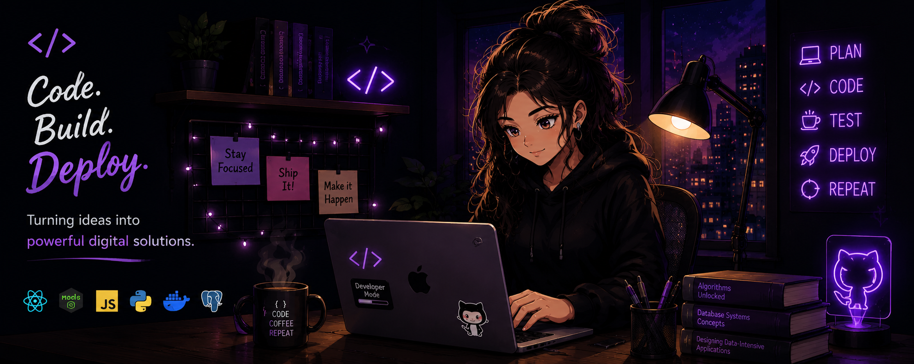

<div align="center">
  
</div>

<div align="center">

# Hi, I'm Oshadi 👋

### Full-Stack Developer · Mobile Developer · AI/ML Enthusiast

Building modern web, mobile, enterprise and blockchain intelligence applications with clean architecture and thoughtful UI/UX.

[](https://github.com/oshadif)


</div>

---

<table>
<tr>
<td width="50%" valign="top">

## 👩‍💻 About Me

- 💻 Full-stack engineer focused on complete real-world products
- 📱 React Native and Flutter mobile development
- 🤖 AI/ML and intelligent application development
- ⛓️ Blockchain analytics and real-time Ethereum intelligence
- 🧩 APIs, databases, enterprise systems and scalable architecture
- ☁️ Docker, Linux, cloud and deployment workflows
- 🚀 Building portfolio-grade products from idea to deployment

</td>
<td width="50%" valign="top">

## ⚡ Current Focus

```text
Full-Stack Engineering  ████████████████████
Mobile Development      ██████████████████░░
AI / Machine Learning   ███████████████░░░░░
Blockchain Engineering  ██████████████░░░░░░
Cloud & DevOps          ████████████░░░░░░░░
```

</td>
</tr>
</table>

## 🛠️ Tech Stack

<div align="center">


</div>

---

## 🚀 Featured Projects

<table>
<tr>
<td width="50%" valign="top">

### 🛡️ [MEV Sentinel](https://github.com/oshadif/MEV-Sentinel)
**Ethereum Mempool Intelligence Platform**

React · Node.js · Ethereum JSON-RPC/WebSockets · MySQL · Socket.IO · Docker

Real-time pending transaction monitoring, DEX router recognition, supported swap decoding, transaction lifecycle tracking, gas intelligence, whale detection, heuristic MEV signals and live analytics. Analytics-only; no transaction execution.

</td>
<td width="50%" valign="top">

### ✈️ [Tourium](https://github.com/oshadif/Tourium)
**Tour & Travel Booking Platform**

React · Vite · Node.js · Express · PostgreSQL · JWT · Docker

Booking workflows, hotels & vehicles, promos, mock payments, PDF invoices, reviews, uploads and admin operations.

</td>
</tr>
<tr>
<td width="50%" valign="top">

### 👥 [PeopleCore HR](https://github.com/oshadif/PeopleCore-HR)
**Human Resource Management Platform**

React · Node.js · Express · PostgreSQL · JWT · Docker

Employees, attendance, leave, payroll, recruitment, performance reviews, RBAC, audit logs and backups.

</td>
<td width="50%" valign="top">

### 🔥 [LeadForge CRM](https://github.com/oshadif/LeadForge-CRM)
**Customer Relationship Management Platform**

React · Node.js · Express · PostgreSQL · JWT · Docker

Leads, contacts, companies, opportunities, pipeline, activities, forecasting, RBAC and audit trails.

</td>
</tr>
<tr>
<td width="50%" valign="top">

### 📦 [StockPilot](https://github.com/oshadif/StockPilot)
**Enterprise Inventory Management System**

React · Node.js · Express · PostgreSQL · JWT · Docker

Multi-warehouse stock, suppliers, purchase orders, transfers, batches, expiry tracking, valuation and audit logs.

</td>
<td width="50%" valign="top">

### 🧾 [RetailFlow POS](https://github.com/oshadif/RetailFlow-POS)
**Enterprise Point-of-Sale System**

React · Node.js · Express · PostgreSQL · JWT · Docker

Barcode workflows, ESC/POS printing, multi-branch inventory, returns/refunds, offline sync, audit logs and backups.

</td>
</tr>
<tr>
<td width="50%" valign="top">

### 🛍️ [CARA](https://github.com/oshadif/CARA)
**Responsive E-Commerce Frontend**

HTML · CSS · JavaScript

Responsive multi-page storefront focused on clean front-end implementation and user experience.

</td>
<td width="50%" valign="top">

### 🔭 Currently Building

Expanding the portfolio with production-style deployment, automated testing, CI/CD, stronger observability and additional intelligent applications.

</td>
</tr>
</table>

---

## 📊 GitHub Activity

<div align="center">


</div>

---

## 🤝 Open to Opportunities

I'm interested in software engineering opportunities where I can build production software, contribute to strong engineering teams, and keep growing across full-stack, mobile, AI/ML, blockchain and cloud engineering.

<div align="center">

### Build. Learn. Improve. Ship.

⭐ Explore the repositories above to see what I'm building.

</div>
